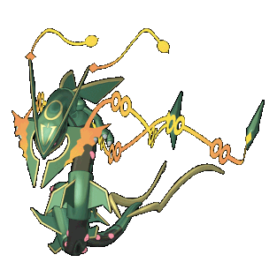

### Bem-Vindo ao meu Perfil! 🤙

Meu nome é Enzo, atualmente cursando Desenvolvimento de Sistemas na escola Senai de Informática!

A procura de colocar as habilidades adiquiridas em prática.

Tenho 16 anos, jogo vôlei🏐 e também sou um amante de jogos🎮.

  
  
 
   
  

### 📞 Entre em Contato: 

### 📚 Habilidades: 

  
  
  
  

 

